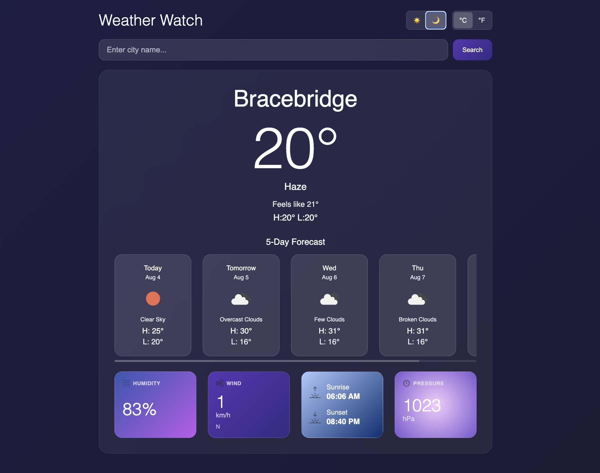

# Weather Watch

A weather dashboard built with React and Vite. Get real-time weather information for any city.

## Screenshot

## Tech Stack

- **React** - UI library
- **Vite** - Build tool and dev server
- **CSS3** - Styling with modern features
- **Weather API** - Real-time weather data
- **Local Storage** - Persistent user preferences

## Getting Started

1. Clone the repository
2. Install dependencies: `npm install`
3. Start the development server: `npm run dev`
4. Open http://localhost:5173 in your browser
